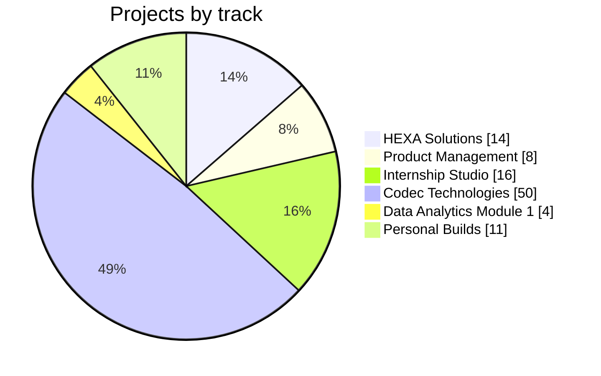

**103 projects · 6 tracks · one navigable dashboard**

> **Start here → [the dashboard](https://eswar5313.github.io/Eswar-Master-Project-Portfolio-2026/).** Filter by track, search by tool, open any card for the full record. Project pages are URL routes on the one dashboard (`#track/project`), so this repository stays small enough to upload in a single step and never breaks a link.

## 🆕 Recent additions (September 2026)

| Added | Scale | Where |
|---|:-:|---|
| Digital Electronics & VLSI track — Verilog/VHDL RTL, Yosys + nextpnr place-and-route, own RTL-to-GDSII flow | 10 projects | [Codec portfolio](https://github.com/Eswar5313/Codec-Technologies-Internship-Portfolio-2026/tree/main/Digital-Electronics-VLSI) |
| Robotics & Automation track — A*/SLAM/PID/Kalman/IK simulations with OpenCV, 143 tests | 10 projects | [Codec portfolio](https://github.com/Eswar5313/Codec-Technologies-Internship-Portfolio-2026/tree/main/Robotics-Automation) |
| Engineering-report PDFs for all 50 Codec projects; Cyber titles filled in | 50 PDFs | [Codec dashboard](https://eswar5313.github.io/Codec-Technologies-Internship-Portfolio-2026/) |

## Why this repository exists
Hiring managers see a CV line; they rarely see the work. This repository puts every project I delivered in 2026 in one place, in one structure — dashboard → track → project → evidence — so the proof behind any CV claim is two clicks away.

## Tracks

| # | Track | Projects | Scope | Open |
|---|-------|:-:|-------|------|
| 01 | **HEXA Solutions — Data Analytics Portfolio** | 14 | 13 end-to-end analytics projects (EDA · SQL · statistics · ML · API pipelines) + the full portfolio submission package | [dashboard](https://eswar5313.github.io/Eswar-Master-Project-Portfolio-2026/#01-HEXA-Data-Analytics) |
| 02 | **Product Management — Case Studies** | 8 | AI-First PM cohort assignments and strategy cases — each with PDF, live-formula workbook and deck; no fabricated user data | [dashboard](https://eswar5313.github.io/Eswar-Master-Project-Portfolio-2026/#02-Product-Management-Case-Studies) |
| 03 | **Internship Studio — 16 Multi-Domain Projects** | 16 | Aug-2026 technical packs (01–07) + upgraded July submissions (08–16); every pack has brief/, report PDF, README and working files | [dashboard](https://eswar5313.github.io/Eswar-Master-Project-Portfolio-2026/#03-Internship-Studio-Projects) |
| 04 | **Codec Technologies — 4 Internship Tracks (50)** | 50 | EV 10 · Cyber Security 20 · Digital Electronics & VLSI 10 · Robotics & Automation 10 — 595+ automated tests, one engineering-report PDF per project; unavailable tools declared as substitutions | [dashboard](https://eswar5313.github.io/Eswar-Master-Project-Portfolio-2026/#04-Codec-Technologies-Internship) |
| 05 | **Data Analytics Module 1 — Excel Mastery** | 4 | Three assignments, one merged workbook: 5,149 live formulas, 0 errors, 187 documented steps, 12 charts | [dashboard](https://eswar5313.github.io/Eswar-Master-Project-Portfolio-2026/#05-Excel-Data-Analytics-Module) |
| 06 | **Personal Builds — Tools, Portfolio Sites & Blogs** | 11 | Self-initiated single-file web tools and publications (personal projects, not professional experience) | [dashboard](https://eswar5313.github.io/Eswar-Master-Project-Portfolio-2026/#06-Personal-Builds-and-Sites) |

## Full project index

<b>HEXA Solutions — Data Analytics Portfolio</b> — 14 projects · <i>Data Analyst (Internship, Jun–Sep 2026)</i>

| # | Project | Headline result | Tools | Evidence |
|---|---|---|---|---|
| 1 | [Portfolio Submission Package](https://eswar5313.github.io/Eswar-Master-Project-Portfolio-2026/#01-HEXA-Data-Analytics/00-Portfolio-Package) | Only dual-route verified figures printed: 99 AED/sqft, CSAT 4.48→3.66, r = −0.60 | Python · SQL · PDF · PPTX | to be attached |
| 2 | [FedEx Logistics EDA](https://eswar5313.github.io/Eswar-Master-Project-Portfolio-2026/#01-HEXA-Data-Analytics/01-FedEx-Logistics-EDA) | Delay-driver breakdown by mode and lane | Python · pandas · matplotlib · seaborn | to be attached |
| 3 | [Mental Health in Tech Survey Analysis](https://eswar5313.github.io/Eswar-Master-Project-Portfolio-2026/#01-HEXA-Data-Analytics/02-Mental-Health-in-Tech) | Segmented view of support gaps by company size | Python · pandas · seaborn | to be attached |
| 4 | [Flipkart Customer Satisfaction (CSAT)](https://eswar5313.github.io/Eswar-Master-Project-Portfolio-2026/#01-HEXA-Data-Analytics/03-Flipkart-CSAT-Analysis) | CSAT gradient 4.48 → 3.66 across the studied dimension (verified) | Python · pandas · Chart.js · HTML | to be attached |
| 5 | [Zomato Restaurant EDA](https://eswar5313.github.io/Eswar-Master-Project-Portfolio-2026/#01-HEXA-Data-Analytics/04-Zomato-Restaurant-EDA) | Cuisine × price × rating patterns | Python · pandas · seaborn | to be attached |
| 6 | [Amazon Prime Video Catalogue EDA](https://eswar5313.github.io/Eswar-Master-Project-Portfolio-2026/#01-HEXA-Data-Analytics/05-Amazon-Prime-Catalogue-EDA) | Catalogue mix and growth view | Python · pandas · matplotlib | to be attached |
| 7 | [Video Game Sales Analysis](https://eswar5313.github.io/Eswar-Master-Project-Portfolio-2026/#01-HEXA-Data-Analytics/06-Video-Game-Sales) | Platform and genre leaders by region | Python · pandas · seaborn | to be attached |
| 8 | [SQL — NSE Stock Market Analysis](https://eswar5313.github.io/Eswar-Master-Project-Portfolio-2026/#01-HEXA-Data-Analytics/07-SQL-NSE-Stock-Market) | Reusable SQL query bank + SQLite DB | SQL · SQLite · Python | to be attached |
| 9 | [India EV Market Dashboard](https://eswar5313.github.io/Eswar-Master-Project-Portfolio-2026/#01-HEXA-Data-Analytics/08-India-EV-Dashboard) | State-wise adoption dashboard | Python · Tableau / Plotly · Excel | to be attached |
| 10 | [Airbnb Listings Dashboard](https://eswar5313.github.io/Eswar-Master-Project-Portfolio-2026/#01-HEXA-Data-Analytics/09-Airbnb-Dashboard) | Price and availability heat-map by neighbourhood | Python · Tableau / Plotly | to be attached |
| 11 | [Strava / Fitbit Fitness Analytics](https://eswar5313.github.io/Eswar-Master-Project-Portfolio-2026/#01-HEXA-Data-Analytics/10-Strava-Fitbit-Fitness-Analytics) | Sedentary-time × sleep correlation r = −0.60 (verified) | Python · pandas · scipy | to be attached |
| 12 | [Uber Supply–Demand Gap](https://eswar5313.github.io/Eswar-Master-Project-Portfolio-2026/#01-HEXA-Data-Analytics/11-Uber-Supply-Demand-Gap) | Hour-band supply-gap diagnosis | Python · pandas · seaborn | to be attached |
| 13 | [Tennis SportRadar API Pipeline](https://eswar5313.github.io/Eswar-Master-Project-Portfolio-2026/#01-HEXA-Data-Analytics/12-Tennis-SportRadar-API-Pipeline) | Working API-to-app pipeline (Streamlit) | Python · REST API · SQLite · Streamlit | to be attached |
| 14 | [Dubai House Price Model](https://eswar5313.github.io/Eswar-Master-Project-Portfolio-2026/#01-HEXA-Data-Analytics/13-Dubai-House-Price-Model) | Price-per-sqft baseline ≈ 99 AED (verified) | Python · scikit-learn · pandas | to be attached |

<b>Product Management — Case Studies</b> — 8 projects · <i>AI-First Product Management cohort (Airtribe, Jun 2026–Jan 2027)</i>

| # | Project | Headline result | Tools | Evidence |
|---|---|---|---|---|
| 1 | [Nykaa App — UX Exploration & Decision Model](https://eswar5313.github.io/Eswar-Master-Project-Portfolio-2026/#02-Product-Management-Case-Studies/01-Nykaa-UX-Exploration) | Master Edition PDF with embedded 380-formula workbook | PDF · Excel · Loom · Gamma | to be attached |
| 2 | [B2B SaaS Strategy — AI Customer Operations Platform](https://eswar5313.github.io/Eswar-Master-Project-Portfolio-2026/#02-Product-Management-Case-Studies/02-AI-Customer-Operations-Platform-B2B-SaaS) | 11-sheet / 211-formula justification workbook, CFO ROI 8.4×, 36-cell sensitivity grid | PDF · Excel · PPTX | to be attached |
| 3 | [Uber — Proactive Pickup Guidance](https://eswar5313.github.io/Eswar-Master-Project-Portfolio-2026/#02-Product-Management-Case-Studies/03-Uber-Pickup-Coordination) | 14-page master, 11-slide zero-white-space deck | PDF · Excel · PPTX | to be attached |
| 4 | [Zepto — Growing Basket Size / AOV](https://eswar5313.github.io/Eswar-Master-Project-Portfolio-2026/#02-Product-Management-Case-Studies/04-Zepto-AOV-Basket-Size) | Segment cards + RICE ranking with workbook support | PDF · Excel | to be attached |
| 5 | [VitaFit — PRD for Engagement & Retention Features](https://eswar5313.github.io/Eswar-Master-Project-Portfolio-2026/#02-Product-Management-Case-Studies/05-VitaFit-PRD-and-Core-Flows) | 50-page master; 13-sheet / 1,503-formula workbook, 0 errors | PDF · Excel · PPTX · Figma/FigJam | to be attached |
| 6 | [Blinkit — Strategy & 5/10-Year Roadmap](https://eswar5313.github.io/Eswar-Master-Project-Portfolio-2026/#02-Product-Management-Case-Studies/06-Blinkit-Strategy-Roadmap) | One-page PDF + 3-slide navy/gold deck | PDF · PPTX | to be attached |
| 7 | [Grocery Delivery — STP Segmentation Sprint](https://eswar5313.github.io/Eswar-Master-Project-Portfolio-2026/#02-Product-Management-Case-Studies/07-Grocery-Delivery-Segmentation-Sprint) | Target segment selected via 5-filter scorecard | PDF · HTML | to be attached |
| 8 | [PM Cohort Lesson Notes & 2026 PM Trends](https://eswar5313.github.io/Eswar-Master-Project-Portfolio-2026/#02-Product-Management-Case-Studies/08-PM-Lesson-Notes-and-Trends) | Lesson-notes PDF + PPT, trends PDF + PPT, skills-gap analysis | PDF · PPTX | to be attached |

<b>Internship Studio — 16 Multi-Domain Projects</b> — 16 projects · <i>Multi-domain intern (Apr 2026–Present)</i>

| # | Project | Headline result | Tools | Evidence |
|---|---|---|---|---|
| 1 | [Project Panopticon — AI Exam Proctoring](https://eswar5313.github.io/Eswar-Master-Project-Portfolio-2026/#03-Internship-Studio-Projects/01-Exam-Proctoring-AI-Panopticon) | Precision 1.00 / recall 0.48 at 0.90 threshold → GO | Python · pandas · scikit-learn · Jupyter | to be attached |
| 2 | [Project Overheat — Predictive Maintenance](https://eswar5313.github.io/Eswar-Master-Project-Portfolio-2026/#03-Internship-Studio-Projects/02-Predictive-Maintenance-IoT-ML) | 3/3 test failures warned 23–24 h ahead at threshold 0.20 | Python · scikit-learn · Jupyter | to be attached |
| 3 | [OrderFlow — Regression Test Prioritisation (APFD)](https://eswar5313.github.io/Eswar-Master-Project-Portfolio-2026/#03-Internship-Studio-Projects/03-Regression-Test-Prioritisation-APFD) | APFD 75.83% → 89.17%; reduced suite T7,T1,T6,T8 = 16 min (−62.8%) | Excel · PDF | to be attached |
| 4 | [Smart Library Management System (C++ & DSA)](https://eswar5313.github.io/Eswar-Master-Project-Portfolio-2026/#03-Internship-Studio-Projects/04-Smart-Library-Management-CPP) | Compiles clean with -Wall -Wextra; valgrind 0 leaks | C++ · DSA | to be attached |
| 5 | [Textile Mill — HT Electricity Bill Energy Audit](https://eswar5313.github.io/Eswar-Master-Project-Portfolio-2026/#03-Internship-Studio-Projects/05-Textile-Electricity-Bill-Energy-Audit) | Annual bill ₹10.76 Cr @ ₹10.26/kWh; savings ₹81.9 L = 7.6% | Excel · PDF | to be attached |
| 6 | [RCC Structural Design (IS 456)](https://eswar5313.github.io/Eswar-Master-Project-Portfolio-2026/#03-Internship-Studio-Projects/06-RCC-Structural-Design-IS456) | Slab D170 10@120; beam 400×750 8-32 + 8-25; column 300×450 8-16, interaction 0.389 | Excel · PDF | to be attached |
| 7 | [CartShare — Collaborative Shopping Cart Web App](https://eswar5313.github.io/Eswar-Master-Project-Portfolio-2026/#03-Internship-Studio-Projects/07-CartShare-Collaborative-Cart) | 54/54 Playwright checks passing | HTML · CSS · JavaScript · Playwright | to be attached |
| 8 | [AutoCAD — Civil / Electrical / Mechanical Drawings](https://eswar5313.github.io/Eswar-Master-Project-Portfolio-2026/#03-Internship-Studio-Projects/08-AutoCAD-Civil-Electrical-Mechanical) | 1,230 entities, DXF audit 0 errors | AutoCAD · ezdxf · DXF | to be attached |
| 9 | [Finance — Ratio Analysis & Aurora Consumer Foods](https://eswar5313.github.io/Eswar-Master-Project-Portfolio-2026/#03-Internship-Studio-Projects/09-Financial-Ratio-Analysis-Aurora-Foods) | Ravi D/E 1.50→1.92; Vijay 10% issue = ₹2.6 L / 9.09% dilution; Aurora: BUY/ACCUMULATE | Excel · PDF | to be attached |
| 10 | [Excel — Multi-Region Sales Dashboard](https://eswar5313.github.io/Eswar-Master-Project-Portfolio-2026/#03-Internship-Studio-Projects/10-Multi-Region-Sales-Dashboard-Excel) | ₹14.26 Cr revenue = 101% of target; West best, South under target | Excel | to be attached |
| 11 | [HR — Policy Framework, Onboarding & Engagement](https://eswar5313.github.io/Eswar-Master-Project-Portfolio-2026/#03-Internship-Studio-Projects/11-HR-Policy-Framework-Onboarding-Engagement) | Engagement budget ₹4,00,000 = ₹5,714/employee (0.95% of payroll) | Word/PDF · Excel | to be attached |
| 12 | [ML — Student Performance Regression](https://eswar5313.github.io/Eswar-Master-Project-Portfolio-2026/#03-Internship-Studio-Projects/12-Student-Performance-ML-Regression) | R² 0.8805, MAE 4.21 | Python · scikit-learn · Jupyter | to be attached |
| 13 | [AWS — EC2 + S3 Node.js app & ROS Noetic deployment](https://eswar5313.github.io/Eswar-Master-Project-Portfolio-2026/#03-Internship-Studio-Projects/13-AWS-EC2-S3-NodeJS-ROS-Deployment) | 7/7 local tests; t2.micro needs 2 GB swap (documented) | AWS EC2 · S3 · Node.js · ROS | to be attached |
| 14 | [Corporate Psychology — TechX Thrive Wellbeing Program](https://eswar5313.github.io/Eswar-Master-Project-Portfolio-2026/#03-Internship-Studio-Projects/14-Employee-Wellbeing-Program-TechX) | Year-1 budget ₹1.21 Cr = ₹23,341/employee | PDF · Excel | to be attached |
| 15 | [Adobe Illustrator — Vector Design Portfolio](https://eswar5313.github.io/Eswar-Master-Project-Portfolio-2026/#03-Internship-Studio-Projects/15-Illustrator-Vector-Design-Portfolio) | 34 originals, no stock or copied art | Illustrator · SVG | to be attached |
| 16 | [Digital Marketing — EcoStyle Facebook Ads Campaign](https://eswar5313.github.io/Eswar-Master-Project-Portfolio-2026/#03-Internship-Studio-Projects/16-EcoStyle-Facebook-Ads-Campaign-Plan) | Base case 181 purchases, ₹2.72 L revenue, ROAS 4.53×, CPA ₹331, +23.5% sales | Excel · PDF · Design | to be attached |

<b>Codec Technologies — 4 Internship Tracks (50)</b> — 50 projects · <i>Intern — Electric Vehicle · Cyber Security · Digital Electronics &amp; VLSI · Robotics &amp; Automation (Aug 2026–Present)</i>

| # | Project | Headline result | Tools | Evidence |
|---|---|---|---|---|
| 1 | [EV 01 — Battery Management System (BMS) Simulation](https://eswar5313.github.io/Eswar-Master-Project-Portfolio-2026/#04-Codec-Technologies-Internship/EV-01-BMS_Simulation) | Automated tests: 23 passed | Python · NumPy · SciPy · SOC/SOH | [report](https://github.com/Eswar5313/Codec-Technologies-Internship-Portfolio-2026/blob/main/Electric-Vehicle/reports/01_BMS_Simulation.pdf) |
| 2 | [EV 02 — EV Charging Station Locator App](https://eswar5313.github.io/Eswar-Master-Project-Portfolio-2026/#04-Codec-Technologies-Internship/EV-02-EV_Charging_Station_Locator_App) | Automated tests: 55 passed | React Native · TypeScript · Google Maps · Jest | [report](https://github.com/Eswar5313/Codec-Technologies-Internship-Portfolio-2026/blob/main/Electric-Vehicle/reports/02_EV_Charging_Station_Locator_App.pdf) |
| 3 | [EV 03 — Solar-Powered EV Charging Station Design](https://eswar5313.github.io/Eswar-Master-Project-Portfolio-2026/#04-Codec-Technologies-Internship/EV-03-Solar_Powered_EV_Charging_Station) | Automated tests: 11 passed | Python · NASA POWER · openpyxl · LCOE | [report](https://github.com/Eswar5313/Codec-Technologies-Internship-Portfolio-2026/blob/main/Electric-Vehicle/reports/03_Solar_Powered_EV_Charging_Station.pdf) |
| 4 | [EV 04 — AI-Powered Driving Efficiency Optimizer](https://eswar5313.github.io/Eswar-Master-Project-Portfolio-2026/#04-Codec-Technologies-Internship/EV-04-AI_Driving_Efficiency_Optimizer) | Automated tests: 13 passed | Python · Scikit-learn · Jupyter · ML | [report](https://github.com/Eswar5313/Codec-Technologies-Internship-Portfolio-2026/blob/main/Electric-Vehicle/reports/04_AI_Driving_Efficiency_Optimizer.pdf) |
| 5 | [EV 05 — EV Drivetrain Modeling & Simulation](https://eswar5313.github.io/Eswar-Master-Project-Portfolio-2026/#04-Codec-Technologies-Internship/EV-05-EV_Drivetrain_Modeling_Simulation) | Automated tests: 15 passed | Python · Motors · Inverter · AC vs DC | [report](https://github.com/Eswar5313/Codec-Technologies-Internship-Portfolio-2026/blob/main/Electric-Vehicle/reports/05_EV_Drivetrain_Modeling_Simulation.pdf) |
| 6 | [EV 06 — IoT-Based EV Health Monitoring System](https://eswar5313.github.io/Eswar-Master-Project-Portfolio-2026/#04-Codec-Technologies-Internship/EV-06-IoT_EV_Health_Monitoring_System) | Automated tests: 17 passed | ESP8266 · IoT · Flask · Dashboard | [report](https://github.com/Eswar5313/Codec-Technologies-Internship-Portfolio-2026/blob/main/Electric-Vehicle/reports/06_IoT_EV_Health_Monitoring_System.pdf) |
| 7 | [EV 07 — Lifecycle Analysis of an Electric Vehicle](https://eswar5313.github.io/Eswar-Master-Project-Portfolio-2026/#04-Codec-Technologies-Internship/EV-07-EV_Lifecycle_Analysis) | Automated tests: 11 passed | Python · LCA · ICCT/CEA · openpyxl | [report](https://github.com/Eswar5313/Codec-Technologies-Internship-Portfolio-2026/blob/main/Electric-Vehicle/reports/07_EV_Lifecycle_Analysis.pdf) |
| 8 | [EV 08 — Smart Traffic Light with EV Priority](https://eswar5313.github.io/Eswar-Master-Project-Portfolio-2026/#04-Codec-Technologies-Internship/EV-08-Smart_Traffic_Light_EV_Priority) | Automated tests: 26 passed | Arduino · RFID/GPS · SimPy · Wokwi | [report](https://github.com/Eswar5313/Codec-Technologies-Internship-Portfolio-2026/blob/main/Electric-Vehicle/reports/08_Smart_Traffic_Light_EV_Priority.pdf) |
| 9 | [EV 09 — Wireless Charging System Design](https://eswar5313.github.io/Eswar-Master-Project-Portfolio-2026/#04-Codec-Technologies-Internship/EV-09-Wireless_Charging_System_Design) | Automated tests: 15 passed | Python · Coils · SAE J2954 · EMF | [report](https://github.com/Eswar5313/Codec-Technologies-Internship-Portfolio-2026/blob/main/Electric-Vehicle/reports/09_Wireless_Charging_System_Design.pdf) |
| 10 | [EV 10 — EV Market Forecast Dashboard](https://eswar5313.github.io/Eswar-Master-Project-Portfolio-2026/#04-Codec-Technologies-Internship/EV-10-EV_Market_Forecast_Dashboard) | Automated tests: 40 passed | Python · Plotly Dash · IEA data · Forecasting | [report](https://github.com/Eswar5313/Codec-Technologies-Internship-Portfolio-2026/blob/main/Electric-Vehicle/reports/10_EV_Market_Forecast_Dashboard.pdf) |
| 11 | [Cyber 01 — VAPT Lab](https://eswar5313.github.io/Eswar-Master-Project-Portfolio-2026/#04-Codec-Technologies-Internship/CYBER-01-VAPT_Lab) | Automated tests: 11 passed | Nmap · Web vulns · CVSS · Flask | [report](https://github.com/Eswar5313/Codec-Technologies-Internship-Portfolio-2026/blob/main/Cyber-Security/reports/01_VAPT_Lab.pdf) |
| 12 | [Cyber 02 — Personal Firewall](https://eswar5313.github.io/Eswar-Master-Project-Portfolio-2026/#04-Codec-Technologies-Internship/CYBER-02-Personal_Firewall) | Automated tests: 11 passed | scapy · iptables · Packet filter | [report](https://github.com/Eswar5313/Codec-Technologies-Internship-Portfolio-2026/blob/main/Cyber-Security/reports/02_Personal_Firewall.pdf) |
| 13 | [Cyber 03 — Intrusion Detection System (ML)](https://eswar5313.github.io/Eswar-Master-Project-Portfolio-2026/#04-Codec-Technologies-Internship/CYBER-03-IDS_ML) | Automated tests: 7 passed | Scikit-learn · NSL-KDD · Anomaly | [report](https://github.com/Eswar5313/Codec-Technologies-Internship-Portfolio-2026/blob/main/Cyber-Security/reports/03_IDS_ML.pdf) |
| 14 | [Cyber 04 — Phishing Detection & Awareness](https://eswar5313.github.io/Eswar-Master-Project-Portfolio-2026/#04-Codec-Technologies-Internship/CYBER-04-Phishing_Detection_and_Awareness) | Automated tests: 8 passed | ML · SPF/DKIM/DMARC · Awareness | [report](https://github.com/Eswar5313/Codec-Technologies-Internship-Portfolio-2026/blob/main/Cyber-Security/reports/04_Phishing_Detection_and_Awareness.pdf) |
| 15 | [Cyber 05 — Secure Web Application](https://eswar5313.github.io/Eswar-Master-Project-Portfolio-2026/#04-Codec-Technologies-Internship/CYBER-05-Secure_Web_Application) | Automated tests: 10 passed | Flask · OWASP · JWT · argon2 | [report](https://github.com/Eswar5313/Codec-Technologies-Internship-Portfolio-2026/blob/main/Cyber-Security/reports/05_Secure_Web_Application.pdf) |
| 16 | [Cyber 06 — Cryptography Algorithms](https://eswar5313.github.io/Eswar-Master-Project-Portfolio-2026/#04-Codec-Technologies-Internship/CYBER-06-Cryptography_Algorithms) | Automated tests: 12 passed | AES · RSA · SHA · cryptography | [report](https://github.com/Eswar5313/Codec-Technologies-Internship-Portfolio-2026/blob/main/Cyber-Security/reports/06_Cryptography_Algorithms.pdf) |
| 17 | [Cyber 07 — Password Hashing & Cracking](https://eswar5313.github.io/Eswar-Master-Project-Portfolio-2026/#04-Codec-Technologies-Internship/CYBER-07-Password_Hashing_and_Cracking) | Automated tests: 8 passed | Hashing · bcrypt · Entropy | [report](https://github.com/Eswar5313/Codec-Technologies-Internship-Portfolio-2026/blob/main/Cyber-Security/reports/07_Password_Hashing_and_Cracking.pdf) |
| 18 | [Cyber 08 — Network Traffic Analysis](https://eswar5313.github.io/Eswar-Master-Project-Portfolio-2026/#04-Codec-Technologies-Internship/CYBER-08-Network_Traffic_Analysis) | Automated tests: 8 passed | scapy · PCAP · C2 · Snort | [report](https://github.com/Eswar5313/Codec-Technologies-Internship-Portfolio-2026/blob/main/Cyber-Security/reports/08_Network_Traffic_Analysis.pdf) |
| 19 | [Cyber 09 — Incident Response Playbook](https://eswar5313.github.io/Eswar-Master-Project-Portfolio-2026/#04-Codec-Technologies-Internship/CYBER-09-Incident_Response_Playbook) | Automated tests: 8 passed | NIST · MITRE ATT&CK · SIEM | [report](https://github.com/Eswar5313/Codec-Technologies-Internship-Portfolio-2026/blob/main/Cyber-Security/reports/09_Incident_Response_Playbook.pdf) |
| 20 | [Cyber 10 — Honeypot](https://eswar5313.github.io/Eswar-Master-Project-Portfolio-2026/#04-Codec-Technologies-Internship/CYBER-10-Honeypot) | Automated tests: 7 passed | Honeypot · Threat intel · Dashboard | [report](https://github.com/Eswar5313/Codec-Technologies-Internship-Portfolio-2026/blob/main/Cyber-Security/reports/10_Honeypot.pdf) |
| 21 | [Cyber 11 — Mobile App Security Testing Framework](https://eswar5313.github.io/Eswar-Master-Project-Portfolio-2026/#04-Codec-Technologies-Internship/CYBER-11-Mobile_App_Security_Testing_Framework) | Automated tests: 8 passed | Android · OWASP Mobile · SAST | [report](https://github.com/Eswar5313/Codec-Technologies-Internship-Portfolio-2026/blob/main/Cyber-Security/reports/11_Mobile_App_Security_Testing_Framework.pdf) |
| 22 | [Cyber 12 — IoT Device Pentest Lab](https://eswar5313.github.io/Eswar-Master-Project-Portfolio-2026/#04-Codec-Technologies-Internship/CYBER-12-IoT_Device_Pentest_Lab) | Automated tests: 9 passed | IoT · Default creds · Firmware | [report](https://github.com/Eswar5313/Codec-Technologies-Internship-Portfolio-2026/blob/main/Cyber-Security/reports/12_IoT_Device_Pentest_Lab.pdf) |
| 23 | [Cyber 13 — Ransomware Behaviour Detection](https://eswar5313.github.io/Eswar-Master-Project-Portfolio-2026/#04-Codec-Technologies-Internship/CYBER-13-Ransomware_Behaviour_Detection) | Automated tests: 17 passed | Detection · Canary · Entropy | [report](https://github.com/Eswar5313/Codec-Technologies-Internship-Portfolio-2026/blob/main/Cyber-Security/reports/13_Ransomware_Behaviour_Detection.pdf) |
| 24 | [Cyber 14 — Threat-Intel Credential-Leak Monitor](https://eswar5313.github.io/Eswar-Master-Project-Portfolio-2026/#04-Codec-Technologies-Internship/CYBER-14-Threat_Intel_Credential_Leak_Monitor) | Automated tests: 13 passed | k-anonymity · OSINT · IOC | [report](https://github.com/Eswar5313/Codec-Technologies-Internship-Portfolio-2026/blob/main/Cyber-Security/reports/14_Threat_Intel_Credential_Leak_Monitor.pdf) |
| 25 | [Cyber 15 — Email Security Gateway](https://eswar5313.github.io/Eswar-Master-Project-Portfolio-2026/#04-Codec-Technologies-Internship/CYBER-15-Email_Security_Gateway) | Automated tests: 23 passed | Email · Scikit-learn · DMARC | [report](https://github.com/Eswar5313/Codec-Technologies-Internship-Portfolio-2026/blob/main/Cyber-Security/reports/15_Email_Security_Gateway.pdf) |
| 26 | [Cyber 16 — Browser Exploit Detection Toolkit](https://eswar5313.github.io/Eswar-Master-Project-Portfolio-2026/#04-Codec-Technologies-Internship/CYBER-16-Browser_Exploit_Detection_Toolkit) | Automated tests: 16 passed | XSS · CSP · Clickjacking | [report](https://github.com/Eswar5313/Codec-Technologies-Internship-Portfolio-2026/blob/main/Cyber-Security/reports/16_Browser_Exploit_Detection_Toolkit.pdf) |
| 27 | [Cyber 17 — Digital Forensics Toolkit](https://eswar5313.github.io/Eswar-Master-Project-Portfolio-2026/#04-Codec-Technologies-Internship/CYBER-17-Digital_Forensics_Toolkit) | Automated tests: 12 passed | Forensics · Carving · Custody | [report](https://github.com/Eswar5313/Codec-Technologies-Internship-Portfolio-2026/blob/main/Cyber-Security/reports/17_Digital_Forensics_Toolkit.pdf) |
| 28 | [Cyber 18 — Secure File Sharing Platform](https://eswar5313.github.io/Eswar-Master-Project-Portfolio-2026/#04-Codec-Technologies-Internship/CYBER-18-Secure_File_Sharing_Platform) | Automated tests: 15 passed | AES-GCM · RSA · Access control | [report](https://github.com/Eswar5313/Codec-Technologies-Internship-Portfolio-2026/blob/main/Cyber-Security/reports/18_Secure_File_Sharing_Platform.pdf) |
| 29 | [Cyber 19 — Insider Threat Detection](https://eswar5313.github.io/Eswar-Master-Project-Portfolio-2026/#04-Codec-Technologies-Internship/CYBER-19-Insider_Threat_Detection) | Automated tests: 9 passed | UBA · IsolationForest · Anomaly | [report](https://github.com/Eswar5313/Codec-Technologies-Internship-Portfolio-2026/blob/main/Cyber-Security/reports/19_Insider_Threat_Detection.pdf) |
| 30 | [Cyber 20 — CTF Platform](https://eswar5313.github.io/Eswar-Master-Project-Portfolio-2026/#04-Codec-Technologies-Internship/CYBER-20-CTF_Platform) | Automated tests: 11 passed | Flask · CTF · Docker · Scoreboard | [report](https://github.com/Eswar5313/Codec-Technologies-Internship-Portfolio-2026/blob/main/Cyber-Security/reports/20_CTF_Platform.pdf) |
| 31 | [VLSI 01 — FPGA Traffic Light Controller with Emergency Priority](https://eswar5313.github.io/Eswar-Master-Project-Portfolio-2026/#04-Codec-Technologies-Internship/VLSI-01-FPGA_Traffic_Light_Priority) 🆕 | Checks: 39 / 39 | Verilog · iverilog · nextpnr-ice40 · synth_xilinx | [report](https://github.com/Eswar5313/Codec-Technologies-Internship-Portfolio-2026/blob/main/Digital-Electronics-VLSI/reports/01_FPGA_Traffic_Light_Priority.pdf) |
| 32 | [VLSI 02 — Low-Power 8-bit ALU (CMOS)](https://eswar5313.github.io/Eswar-Master-Project-Portfolio-2026/#04-Codec-Technologies-Internship/VLSI-02-LowPower_8bit_ALU_CMOS) 🆕 | RTL ↔ gate match: 4 × 590/590 | Verilog · Yosys+ABC · gate-level power · mini-STA | [report](https://github.com/Eswar5313/Codec-Technologies-Internship-Portfolio-2026/blob/main/Digital-Electronics-VLSI/reports/02_LowPower_8bit_ALU_CMOS.pdf) |
| 33 | [VLSI 03 — Smart Digital Lock (VHDL)](https://eswar5313.github.io/Eswar-Master-Project-Portfolio-2026/#04-Codec-Technologies-Internship/VLSI-03-Smart_Digital_Lock_VHDL) 🆕 | Checks: 38 / 38 | VHDL-2008 · GHDL · yosys -m ghdl · nextpnr-ice40 | [report](https://github.com/Eswar5313/Codec-Technologies-Internship-Portfolio-2026/blob/main/Digital-Electronics-VLSI/reports/03_Smart_Digital_Lock_VHDL.pdf) |
| 34 | [VLSI 04 — FIR Filter for DSP (3 architectures)](https://eswar5313.github.io/Eswar-Master-Project-Portfolio-2026/#04-Codec-Technologies-Internship/VLSI-04-FIR_Filter_DSP_VLSI) 🆕 | Bit-exact vs model: 3 / 3 | scipy→Q1.15 · Verilog · FPGA + ASIC compare | [report](https://github.com/Eswar5313/Codec-Technologies-Internship-Portfolio-2026/blob/main/Digital-Electronics-VLSI/reports/04_FIR_Filter_DSP_VLSI.pdf) |
| 35 | [VLSI 05 — UART Protocol (VHDL)](https://eswar5313.github.io/Eswar-Master-Project-Portfolio-2026/#04-Codec-Technologies-Internship/VLSI-05-UART_Protocol_VHDL) 🆕 | Frames / checks: 46 / 68 | VHDL-2008 · GHDL · nextpnr-ice40 · pyserial script | [report](https://github.com/Eswar5313/Codec-Technologies-Internship-Portfolio-2026/blob/main/Digital-Electronics-VLSI/reports/05_UART_Protocol_VHDL.pdf) |
| 36 | [VLSI 06 — Smart Energy Meter with GSM](https://eswar5313.github.io/Eswar-Master-Project-Portfolio-2026/#04-Codec-Technologies-Internship/VLSI-06-Smart_Energy_Meter_GSM) 🆕 | Registers bit-exact: 37 / 37 | Verilog DSP · C firmware · mock SIM800L · billing | [report](https://github.com/Eswar5313/Codec-Technologies-Internship-Portfolio-2026/blob/main/Digital-Electronics-VLSI/reports/06_Smart_Energy_Meter_GSM.pdf) |
| 37 | [VLSI 07 — 4-bit Processor](https://eswar5313.github.io/Eswar-Master-Project-Portfolio-2026/#04-Codec-Technologies-Internship/VLSI-07-4bit_Processor_Design) 🆕 | Programs verified: 3 / 3 | Verilog · assembler · golden model · nextpnr-ice40 | [report](https://github.com/Eswar5313/Codec-Technologies-Internship-Portfolio-2026/blob/main/Digital-Electronics-VLSI/reports/07_4bit_Processor_Design.pdf) |
| 38 | [VLSI 08 — ASIC Flow: RTL to GDSII](https://eswar5313.github.io/Eswar-Master-Project-Portfolio-2026/#04-Codec-Technologies-Internship/VLSI-08-ASIC_RTL_to_GDSII_OpenSource) 🆕 | RTL ↔ gate checksum: identical | Yosys · pyflow · GDSII writer · ORFS config | [report](https://github.com/Eswar5313/Codec-Technologies-Internship-Portfolio-2026/blob/main/Digital-Electronics-VLSI/reports/08_ASIC_RTL_to_GDSII_OpenSource.pdf) |
| 39 | [VLSI 09 — IoT Home Automation (Digital Logic)](https://eswar5313.github.io/Eswar-Master-Project-Portfolio-2026/#04-Codec-Technologies-Internship/VLSI-09-IoT_Home_Automation_Digital_Logic) 🆕 | Checks: 40 / 40 | Verilog · UART regs · clock gating · ESP8266 .ino | [report](https://github.com/Eswar5313/Codec-Technologies-Internship-Portfolio-2026/blob/main/Digital-Electronics-VLSI/reports/09_IoT_Home_Automation_Digital_Logic.pdf) |
| 40 | [VLSI 10 — Digital Voting Machine with Secure Memory](https://eswar5313.github.io/Eswar-Master-Project-Portfolio-2026/#04-Codec-Technologies-Internship/VLSI-10-Digital_Voting_Machine_Secure_Memory) 🆕 | Checks: 32 / 32 | Verilog · I²C master · EEPROM model · CRC-8 | [report](https://github.com/Eswar5313/Codec-Technologies-Internship-Portfolio-2026/blob/main/Digital-Electronics-VLSI/reports/10_Digital_Voting_Machine_Secure_Memory.pdf) |
| 41 | [Robotics 01 — Autonomous Warehouse Robot](https://eswar5313.github.io/Eswar-Master-Project-Portfolio-2026/#04-Codec-Technologies-Internship/ROBOTICS-01-Autonomous_Warehouse_Robot) 🆕 | Picks / collisions: 6 / 6 · 0 | A* / Dijkstra · LiDAR sim · OpenCV · ROS 2 pkg | [report](https://github.com/Eswar5313/Codec-Technologies-Internship-Portfolio-2026/blob/main/Robotics-Automation/reports/01_Autonomous_Warehouse_Robot.pdf) |
| 42 | [Robotics 02 — Robotic Arm Quality Inspection](https://eswar5313.github.io/Eswar-Master-Project-Portfolio-2026/#04-Codec-Technologies-Internship/ROBOTICS-02-Robotic_Arm_Quality_Inspection) 🆕 | Classical / SVM accuracy: 96.0 / 97.3 % | OpenCV · SVM / RF · DH + IK · RoboDK script | [report](https://github.com/Eswar5313/Codec-Technologies-Internship-Portfolio-2026/blob/main/Robotics-Automation/reports/02_Robotic_Arm_Quality_Inspection.pdf) |
| 43 | [Robotics 03 — Voice-Controlled Home Automation Bot](https://eswar5313.github.io/Eswar-Master-Project-Portfolio-2026/#04-Codec-Technologies-Internship/ROBOTICS-03-Voice_Controlled_Home_Bot) 🆕 | Words @ 20 / 5 dB: 98.3 / 95.8 % | MFCC + DTW · parser · Webots .wbt · ROS 2 pkg | [report](https://github.com/Eswar5313/Codec-Technologies-Internship-Portfolio-2026/blob/main/Robotics-Automation/reports/03_Voice_Controlled_Home_Bot.pdf) |
| 44 | [Robotics 04 — Self-Balancing Two-Wheel Robot](https://eswar5313.github.io/Eswar-Master-Project-Portfolio-2026/#04-Codec-Technologies-Internship/ROBOTICS-04-Self_Balancing_Robot) 🆕 | Recovery from 10°: 0.65 s | RK4 1 kHz · Kalman · cascaded PID · Gazebo .sdf | [report](https://github.com/Eswar5313/Codec-Technologies-Internship-Portfolio-2026/blob/main/Robotics-Automation/reports/04_Self_Balancing_Robot.pdf) |
| 45 | [Robotics 05 — Autonomous Surveillance Drone](https://eswar5313.github.io/Eswar-Master-Project-Portfolio-2026/#04-Codec-Technologies-Internship/ROBOTICS-05-Surveillance_Drone) 🆕 | Waypoints reached: 12 / 12 | GPS waypoints · MOG2 + HOG · tracker · AirSim script | [report](https://github.com/Eswar5313/Codec-Technologies-Internship-Portfolio-2026/blob/main/Robotics-Automation/reports/05_Surveillance_Drone.pdf) |
| 46 | [Robotics 06 — Smart Farming Robot](https://eswar5313.github.io/Eswar-Master-Project-Portfolio-2026/#04-Codec-Technologies-Internship/ROBOTICS-06-Smart_Farming_Robot) 🆕 | Water vs timer: −77 % | ExG / VARI / NDVI · irrigation ctrl · dashboard · ROS 2 pkg | [report](https://github.com/Eswar5313/Codec-Technologies-Internship-Portfolio-2026/blob/main/Robotics-Automation/reports/06_Smart_Farming_Robot.pdf) |
| 47 | [Robotics 07 — Gesture-Controlled Robotic Arm](https://eswar5313.github.io/Eswar-Master-Project-Portfolio-2026/#04-Codec-Technologies-Internship/ROBOTICS-07-Gesture_Controlled_Arm) 🆕 | Recogniser (300 frames): 95.6 % | OpenCV · LM IK · One-Euro · MediaPipe adapter | [report](https://github.com/Eswar5313/Codec-Technologies-Internship-Portfolio-2026/blob/main/Robotics-Automation/reports/07_Gesture_Controlled_Arm.pdf) |
| 48 | [Robotics 08 — Search & Rescue Robot (SLAM)](https://eswar5313.github.io/Eswar-Master-Project-Portfolio-2026/#04-Codec-Technologies-Internship/ROBOTICS-08-Search_Rescue_Robot) 🆕 | Victims found: 4 / 4 in 164 s | SLAM · frontier A* · TDOA · Nav2 skeleton | [report](https://github.com/Eswar5313/Codec-Technologies-Internship-Portfolio-2026/blob/main/Robotics-Automation/reports/08_Search_Rescue_Robot.pdf) |
| 49 | [Robotics 09 — Automated Multi-Level Parking](https://eswar5313.github.io/Eswar-Master-Project-Portfolio-2026/#04-Codec-Technologies-Internship/ROBOTICS-09-Automated_Parking_System) 🆕 | Collisions (16 runs): 0 | DES · A* / Dijkstra · Erlang-C · Unity stub | [report](https://github.com/Eswar5313/Codec-Technologies-Internship-Portfolio-2026/blob/main/Robotics-Automation/reports/09_Automated_Parking_System.pdf) |
| 50 | [Robotics 10 — Industrial Conveyor Sorting](https://eswar5313.github.io/Eswar-Master-Project-Portfolio-2026/#04-Codec-Technologies-Internship/ROBOTICS-10-Conveyor_Sorting_Automation) 🆕 | Vision (600 items): 99.7 % | OpenCV · SCARA IK · DES · RoboDK script | [report](https://github.com/Eswar5313/Codec-Technologies-Internship-Portfolio-2026/blob/main/Robotics-Automation/reports/10_Conveyor_Sorting_Automation.pdf) |

<b>Data Analytics Module 1 — Excel Mastery</b> — 4 projects · <i>Data Analytics trainee (Aug 2026)</i>

| # | Project | Headline result | Tools | Evidence |
|---|---|---|---|---|
| 1 | [Assignment 1 — Data Exploration](https://eswar5313.github.io/Eswar-Master-Project-Portfolio-2026/#05-Excel-Data-Analytics-Module/01-Data-Exploration) | 34 products, total $10,100, avg $297.06; 758 live formulas | Excel | to be attached |
| 2 | [Assignment 2 — Data Cleaning Pipeline](https://eswar5313.github.io/Eswar-Master-Project-Portfolio-2026/#05-Excel-Data-Analytics-Module/02-Data-Cleaning-Pipeline) | 34→32 rows, 6→11 columns; 2,894 live formulas; defects declared as injected | Excel · PDF | to be attached |
| 3 | [Assignment 3 — Advanced Analysis](https://eswar5313.github.io/Eswar-Master-Project-Portfolio-2026/#05-Excel-Data-Analytics-Module/03-Advanced-Analysis-Lookups-Pivots-Dashboard) | 1,497 formulas, 0 errors; dashboard tested on 3 filter combinations | Excel · PDF | to be attached |
| 4 | [All-in-One Workbook + Submission Package](https://eswar5313.github.io/Eswar-Master-Project-Portfolio-2026/#05-Excel-Data-Analytics-Module/04-All-In-One-Workbook-and-Submission) | 5,149 formulas, 0 errors, 12 charts, 5 drop-downs | Excel · PDF | to be attached |

<b>Personal Builds — Tools, Portfolio Sites &amp; Blogs</b> — 11 projects · <i>Builder</i>

| # | Project | Headline result | Tools | Evidence |
|---|---|---|---|---|
| 1 | [Career Control Tower — GitHub Profile Dashboard](https://eswar5313.github.io/Eswar-Master-Project-Portfolio-2026/#06-Personal-Builds-and-Sites/01-Career-Control-Tower-GitHub-Profile) | 7 pages, KPI badges, fitment snapshots | Markdown · Mermaid · GitHub | to be attached |
| 2 | [Portfolio Websites (5 themes)](https://eswar5313.github.io/Eswar-Master-Project-Portfolio-2026/#06-Personal-Builds-and-Sites/02-Portfolio-Websites) | Filterable project showcases, animated KPI bands | HTML · CSS · JS · Next.js | to be attached |
| 3 | [Eswar Application Engine](https://eswar5313.github.io/Eswar-Master-Project-Portfolio-2026/#06-Personal-Builds-and-Sites/03-Application-Engine) | Uses only verified metrics | HTML · JS | to be attached |
| 4 | [Career Tool Suite (Netlify)](https://eswar5313.github.io/Eswar-Master-Project-Portfolio-2026/#06-Personal-Builds-and-Sites/04-Career-Tool-Suite) | 5 deployed single-file tools | HTML · JS · Netlify | to be attached |
| 5 | [Master Financial Ledger](https://eswar5313.github.io/Eswar-Master-Project-Portfolio-2026/#06-Personal-Builds-and-Sites/05-Master-Financial-Ledger) | Diagnosed localStorage quota issue from base64 images | HTML · JS · Tesseract.js | to be attached |
| 6 | [All-in-One Project Register](https://eswar5313.github.io/Eswar-Master-Project-Portfolio-2026/#06-Personal-Builds-and-Sites/06-All-In-One-Project-Register) | 55-page PDF, 1,717-formula Excel, single-file dashboard | PDF · Excel · HTML | to be attached |
| 7 | [Pickup Notebook — Case-Study Blog](https://eswar5313.github.io/Eswar-Master-Project-Portfolio-2026/#06-Personal-Builds-and-Sites/07-Pickup-Notebook-Blog) | Netlify deploy, relative cross-links | HTML · CSS | to be attached |
| 8 | [The 2,000 SKU Problem — Blog](https://eswar5313.github.io/Eswar-Master-Project-Portfolio-2026/#06-Personal-Builds-and-Sites/08-The-2000-SKU-Problem-Blog) | 4 essays + hub | HTML · CSS | to be attached |
| 9 | [AI Insights Journal](https://eswar5313.github.io/Eswar-Master-Project-Portfolio-2026/#06-Personal-Builds-and-Sites/09-AI-Insights-Journal) | Stat sidebars, reading-progress bar, Read-Next cards | HTML · CSS | to be attached |
| 10 | [PM Strategy Series & Product-Craft Blogs](https://eswar5313.github.io/Eswar-Master-Project-Portfolio-2026/#06-Personal-Builds-and-Sites/10-PM-Strategy-and-Product-Craft-Blogs) | 9 single-file navy/gold blog sites | HTML · CSS | to be attached |
| 11 | [Company Assessments & Assignments](https://eswar5313.github.io/Eswar-Master-Project-Portfolio-2026/#06-Personal-Builds-and-Sites/11-Assessments-and-Assignments) | Full submission packages delivered | PDF · PPTX · Excel · Python | to be attached |

## Evidence
- **Codec Technologies (50 projects)** — every card links to its engineering-report PDF in [Codec-Technologies-Internship-Portfolio-2026](https://github.com/Eswar5313/Codec-Technologies-Internship-Portfolio-2026); the complete source trees are the `*_source.zip` archives in that repo (unzip → each project runs with `run_all.sh`).
- **HEXA, Product Management, Internship Studio, Excel Module, Personal builds (53 projects)** — the deliverables (PDF reports, workbooks, decks, code) are being attached as GitHub Releases / linked drives; until a card shows an Evidence button, the `projects.json` record lists the file names that exist for it. Nothing is claimed here that does not exist as a file.
- Machine-readable registry: [`projects.json`](projects.json). The Lens Index repo re-indexes the same 103 projects by skill, tool, sector, target role and method: [Eswar-Portfolio-Lens-Index-2026](https://github.com/Eswar5313/Eswar-Portfolio-Lens-Index-2026).

## Standards that run through every project
Verified figures only · declared substitutions wherever a real dataset or a named tool could not be used · AI partnership disclosed (Claude for structuring, drafting and code review; analysis, decisions, interviews and submissions are mine) · zero-white-space documents, measured not eyeballed · defensive security only.

## Contact
**Eswar Mahalingam** · Ghaziabad, NCR, India · eswarmba05313@gmail.com · +91-9360548243 · [LinkedIn](https://linkedin.com/in/eswar-mahalingam) · [GitHub](https://github.com/Eswar5313)

